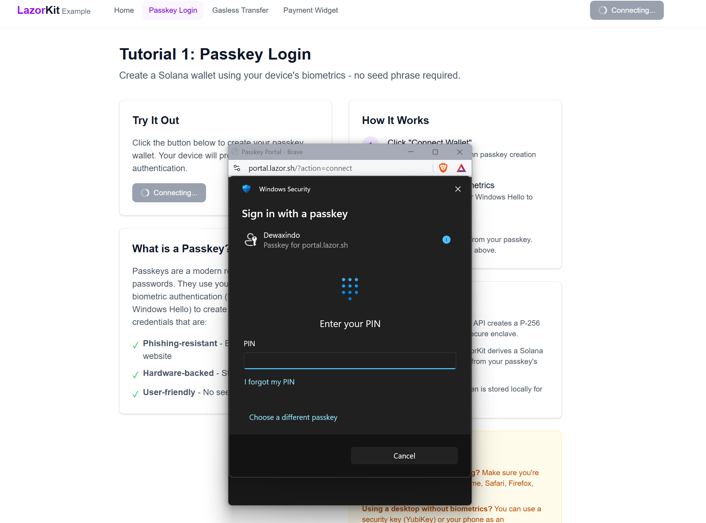
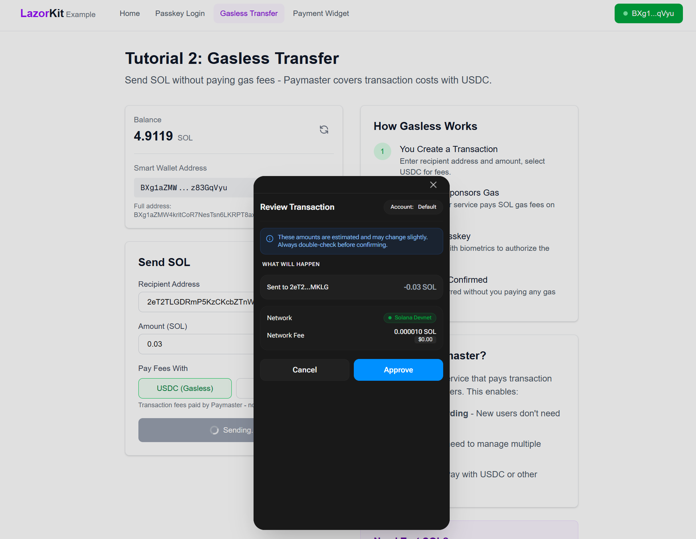
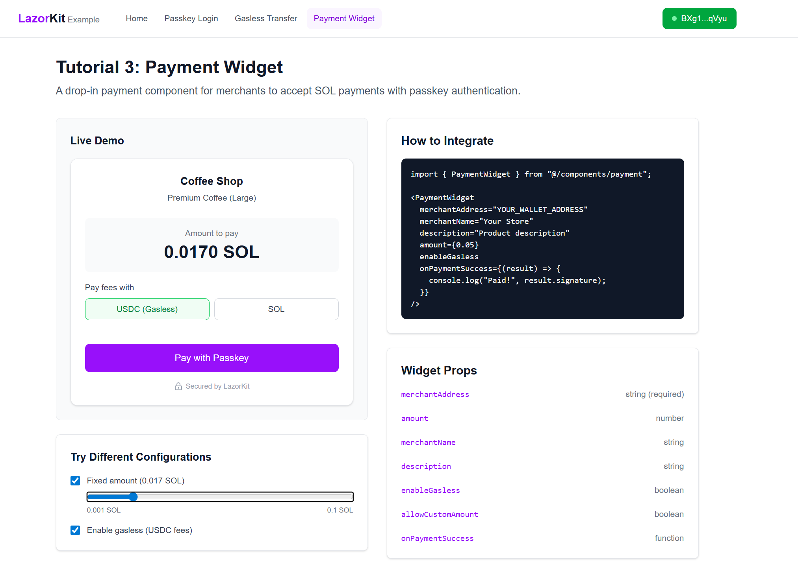
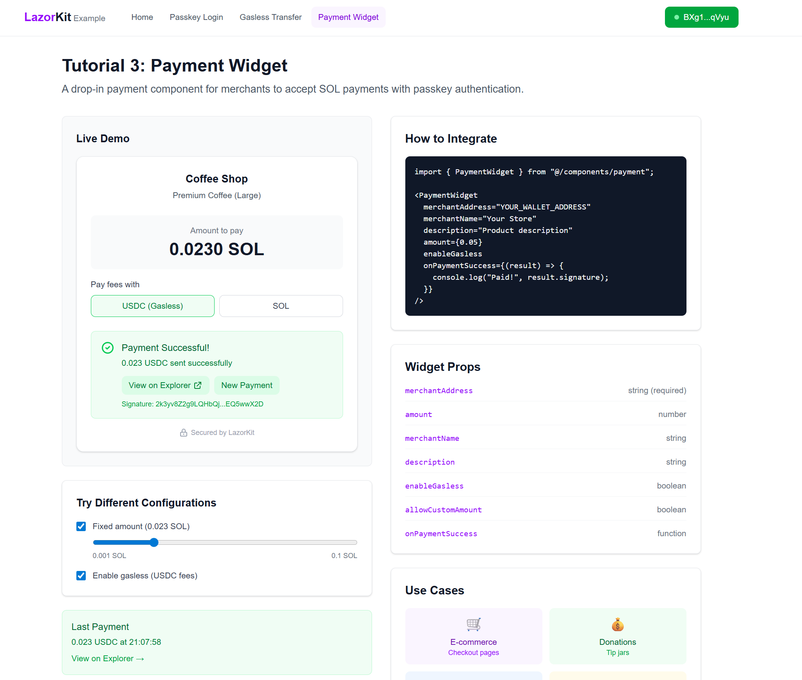

# 🔐 LazorKit SDK Integration Example

<div align="center">


**Passkey-based wallet creation and gasless transactions on Solana**

_No seed phrases. Just biometrics._ 🚀

[Live Demo](https://lazorkit-lovat.vercel.app) • [Documentation](#-tutorials) • [Quick Start](#-quick-start)

</div>

---

## ✨ Features

| Feature                       | Description                                                     |
| ----------------------------- | --------------------------------------------------------------- |
| 🔑 **Passkey Authentication** | Create Solana wallets using Face ID, Touch ID, or Windows Hello |
| ⛽ **Gasless Transactions**   | Send SOL without paying gas fees (Paymaster covers costs)       |
| 💳 **Payment Widget**         | Drop-in payment component for merchants                         |
| 🏦 **Smart Wallet**           | Program Derived Address (PDA) derived from your passkey         |
| 💾 **Session Persistence**    | Stay connected across page refreshes                            |
| ⚡ **Modern Stack**           | Built with Next.js 16, TypeScript, and Tailwind CSS             |

---

## 💡 Why LazorKit?

<div align="center">

### The Problem with Traditional Wallets

</div>

<table>
<tr>
<td align="center" width="50%">
<h3>❌ Traditional Wallets</h3>
</td>
<td align="center" width="50%">
<h3>✅ LazorKit</h3>
</td>
</tr>
<tr>
<td>

| Pain Point | Issue |
|------------|-------|
| 📝 **Seed Phrases** | 12-24 words to backup & secure |
| 🔑 **Key Management** | Complex, error-prone |
| 💸 **Gas Fees** | Users pay for every transaction |
| 😰 **Recovery** | Lose phrase = lose everything |
| 🚪 **Onboarding** | High friction, many steps |

</td>
<td>

| Solution | Benefit |
|----------|---------|
| 🚫 **No Seed Phrases** | Passkeys secured by device |
| 👆 **Biometric Auth** | Face ID, Touch ID, Windows Hello |
| ⛽ **Gasless Options** | Paymaster covers fees |
| 🔄 **Recoverable** | Passkeys sync via iCloud/Google |
| ⚡ **One-Tap Onboarding** | Familiar, instant UX |

</td>
</tr>
</table>

<div align="center">

### 🎯 Perfect For

<table>
<tr>
<td align="center">🎮<br/><strong>Games</strong></td>
<td align="center">📱<br/><strong>Consumer Apps</strong></td>
<td align="center">💰<br/><strong>DeFi Onboarding</strong></td>
<td align="center">🛒<br/><strong>Merchant Payments</strong></td>
<td align="center">🌐<br/><strong>Web3 Newcomers</strong></td>
</tr>
</table>

*Any app targeting non-crypto-native users*

</div>

---

## 🎯 Live Demo

> **[https://lazorkit-lovat.vercel.app](https://lazorkit-lovat.vercel.app)**

| Page                                                                      | Description                   |
| ------------------------------------------------------------------------- | ----------------------------- |
| 🏠 [Home](https://lazorkit-lovat.vercel.app)                              | Overview and navigation       |
| 🔐 [Passkey Login](https://lazorkit-lovat.vercel.app/passkey-login)       | Create wallet with biometrics |
| 💸 [Gasless Transfer](https://lazorkit-lovat.vercel.app/gasless-transfer) | Send SOL without gas fees     |
| 🛒 [Payment Widget](https://lazorkit-lovat.vercel.app/payment-widget)     | Merchant payment component    |
| 📱 [Cross-Device](https://lazorkit-lovat.vercel.app/cross-device)         | Access wallet from any device |

### 📸 Screenshots

<table>
<tr>
<td align="center" width="50%">
<strong>Passkey Authentication</strong><br/>

<br/><em>One-tap biometric wallet creation</em>
</td>
<td align="center" width="50%">
<strong>Gasless Transfer</strong><br/>

<br/><em>Send SOL without paying gas fees</em>
</td>
</tr>
<tr>
<td align="center" width="50%">
<strong>Payment Widget</strong><br/>

<br/><em>Drop-in payment component</em>
</td>
<td align="center" width="50%">
<strong>Transaction Success</strong><br/>

<br/><em>Real-time confirmation with Explorer link</em>
</td>
</tr>
</table>

---

## 🛠️ Tech Stack

| Technology           | Version | Purpose                         |
| -------------------- | ------- | ------------------------------- |
| ⚛️ Next.js           | 16.1.1  | React framework with App Router |
| 📘 TypeScript        | 5.x     | Type safety                     |
| 🎨 Tailwind CSS      | 4.x     | Styling                         |
| 🔐 @lazorkit/wallet  | 2.0.1   | Passkey wallet SDK              |
| ⛓️ @solana/web3.js   | 1.98.4  | Solana blockchain interaction   |
| ⚓ @coral-xyz/anchor | 0.32.1  | Solana program framework        |

---

## 📋 Prerequisites

Before you begin, ensure you have:

| Requirement             | Details                                           |
| ----------------------- | ------------------------------------------------- |
| 📦 **Node.js 20+**      | [Download here](https://nodejs.org/)              |
| 📦 **pnpm 8+**          | `npm install -g pnpm`                             |
| 🌐 **WebAuthn Browser** | Chrome 108+, Safari 16+, Firefox 122+, Edge 108+  |
| 👆 **Biometrics**       | Face ID, Touch ID, Windows Hello, or Security Key |

---

## 🚀 Quick Start

### 1️⃣ Clone the repository

```bash
git clone https://github.com/BadGenius22/Lazorkit.git
cd Lazorkit
```

### 2️⃣ Install dependencies

```bash
pnpm install
```

### 3️⃣ Configure environment

Create `.env.local` in the project root:

```env
# 🌐 Solana RPC (Devnet)
NEXT_PUBLIC_RPC_URL=https://api.devnet.solana.com

# 🔐 LazorKit Portal (Passkey service)
NEXT_PUBLIC_PORTAL_URL=https://portal.lazor.sh

# ⛽ Paymaster (Gasless transactions)
NEXT_PUBLIC_PAYMASTER_URL=https://kora.devnet.lazorkit.com
```

### 4️⃣ Start development server

```bash
pnpm dev
```

### 5️⃣ Open in browser

> 🌐 **[http://localhost:3000](http://localhost:3000)**

---

## 📁 Project Structure

```
📦 Lazorkit/
├── 📂 app/                      # Next.js App Router
│   ├── 📄 layout.tsx            # Root layout with providers
│   ├── 📄 page.tsx              # Homepage
│   ├── 📄 providers.tsx         # LazorkitProvider wrapper
│   ├── 🎨 globals.css           # Global styles
│   ├── 📂 passkey-login/        # 🔐 Tutorial 1
│   ├── 📂 gasless-transfer/     # 💸 Tutorial 2
│   └── 📂 payment-widget/       # 🛒 Tutorial 3
│
├── 📂 components/               # Reusable UI components
│   ├── 🔘 ConnectButton.tsx     # Wallet connect/disconnect
│   ├── 🧭 Navbar.tsx            # Navigation header
│   ├── 📝 TransferForm.tsx      # SOL transfer form
│   ├── 💰 WalletInfo.tsx        # Balance & address display
│   └── 📂 payment/              # Payment widget components
│       ├── 💳 PaymentWidget.tsx # Main payment component
│       └── 📊 PaymentStatus.tsx # Transaction status
│
├── 📂 hooks/                    # Custom React hooks
│   ├── 💰 useBalance.ts         # SOL balance fetching
│   └── 💳 usePayment.ts         # Payment logic
│
├── 📂 lib/                      # Utilities
│   ├── ⚙️ constants.ts          # Config & helpers
│   └── 💳 solana-pay.ts         # Solana Pay utilities
│
└── ⚙️ next.config.ts            # Next.js configuration
```

---

## 📖 Quick API Reference

### Hooks

```typescript
import { useBalance, usePayment } from "@/hooks";

// Fetch wallet balance (auto-refreshes every 30s)
const { balance, isLoading, refresh } = useBalance(address);

// Process payments with status tracking
const { pay, status, result, error, reset } = usePayment({
  merchantAddress: "YOUR_WALLET",
  onPaymentSuccess: (result) => console.log(result.signature),
});
await pay(0.05, "USDC"); // Gasless payment
```

### Components

```typescript
import { ConnectButton, PaymentWidget, ErrorBoundary } from "@/components";

// Wallet connection (passkey auth)
<ConnectButton />

// Drop-in payment form
<PaymentWidget
  merchantAddress="YOUR_WALLET"
  merchantName="Coffee Shop"
  amount={0.05}
  enableGasless
/>

// Error handling wrapper
<ErrorBoundary onError={(e) => logError(e)}>
  <YourApp />
</ErrorBoundary>
```

### Utilities

```typescript
import {
  getExplorerUrl,
  truncateAddress,
  formatSol,
  confirmTransaction,
} from "@/lib";

getExplorerUrl("5xK9p...");        // Solscan transaction URL
truncateAddress("7xKp...", 4);     // "7xKp...3mNq"
formatSol(1_500_000_000);          // "1.50"
await confirmTransaction({         // Poll until confirmed
  signature: "5xK9p...",
  timeout: 30000,
});
```

---

## 📚 Tutorials

<table>
<tr>
<td width="50%">

### 🔐 [Tutorial 1: Passkey Login](docs/01-passkey-login.md)

**Create a Solana wallet using biometrics**

```
User clicks "Connect"
       ↓
Browser shows biometric prompt
       ↓
Passkey created in secure enclave
       ↓
Smart wallet derived ✨
```

| Concept                 | Status |
| ----------------------- | ------ |
| WebAuthn/FIDO2 passkey  | ✅     |
| Smart wallet derivation | ✅     |
| Session persistence     | ✅     |

</td>
<td width="50%">

### 💸 [Tutorial 2: Gasless Transfer](docs/02-gasless-transfer.md)

**Send SOL without paying gas fees**

```
User creates transaction
       ↓
Paymaster sponsors gas
       ↓
No SOL needed for fees! 🎉
```

| Concept                | Status |
| ---------------------- | ------ |
| Transfer instructions  | ✅     |
| Paymaster-sponsored tx | ✅     |
| Fee token selection    | ✅     |

</td>
</tr>
<tr>
<td width="50%">

### 🛒 [Tutorial 3: Payment Widget](docs/03-payment-widget.md)

**Drop-in payment component for merchants**

```
Add <PaymentWidget />
       ↓
User pays with passkey
       ↓
Receive SOL instantly 💰
```

| Concept            | Status |
| ------------------ | ------ |
| Widget integration | ✅     |
| Merchant callbacks | ✅     |
| Real-time status   | ✅     |

</td>
<td width="50%">

### 📱 [Tutorial 4: Cross-Device Session](docs/04-cross-device-session.md)

**Access wallet from any synced device**

```
Create wallet on iPhone
       ↓
Passkey syncs via iCloud
       ↓
Same wallet on MacBook 🔄
```

| Concept                    | Status |
| -------------------------- | ------ |
| iCloud/Google/Windows sync | ✅     |
| Multi-device access        | ✅     |
| No seed phrase needed      | ✅     |

</td>
</tr>
</table>

<details>
<summary><b>📝 Quick Code Examples</b></summary>

#### 🔐 Passkey Login

```tsx
import { useWallet } from "@lazorkit/wallet";

const { connect, isConnected, smartWalletPubkey } = useWallet();

// Connect triggers biometric prompt
await connect();
```

#### 💸 Gasless Transfer

```tsx
const signature = await signAndSendTransaction({
  instructions: [
    SystemProgram.transfer({
      fromPubkey: smartWalletPubkey,
      toPubkey: recipientPubkey,
      lamports: 0.1 * LAMPORTS_PER_SOL,
    }),
  ],
  transactionOptions: {
    feeToken: "USDC", // ⛽ Gasless - Paymaster pays
  },
});
```

#### 🛒 Payment Widget

```tsx
import { PaymentWidget } from "@/components/payment";

<PaymentWidget
  merchantAddress="YOUR_WALLET_ADDRESS"
  merchantName="Coffee Shop"
  amount={0.05}
  enableGasless
  onPaymentSuccess={(result) => console.log("Paid!", result.signature)}
/>;
```

#### 📱 Cross-Device Session

```tsx
// Passkeys sync automatically via platform ecosystems
// Same passkey = Same wallet address on any device

// iPhone: deriveFromPasskey(passkey) → "7xKp...3mNq"
// MacBook: deriveFromPasskey(passkey) → "7xKp...3mNq" ✓
```

</details>

---

## 🔧 SDK Reference

### Provider Setup

```tsx
// app/providers.tsx
import { LazorkitProvider } from "@lazorkit/wallet";

export function Providers({ children }) {
  return (
    <LazorkitProvider
      rpcUrl={process.env.NEXT_PUBLIC_RPC_URL}
      portalUrl={process.env.NEXT_PUBLIC_PORTAL_URL}
      paymasterConfig={{
        paymasterUrl: process.env.NEXT_PUBLIC_PAYMASTER_URL,
      }}
    >
      {children}
    </LazorkitProvider>
  );
}
```

### useWallet Hook

```tsx
import { useWallet } from "@lazorkit/wallet";

const {
  connect, // 🔐 Trigger passkey creation/login
  disconnect, // 🚪 Clear session
  isConnected, // ✅ Boolean - wallet connected
  isConnecting, // ⏳ Boolean - connection in progress
  smartWalletPubkey, // 📍 PublicKey - derived wallet address
  signAndSendTransaction, // ✍️ Send transactions
} = useWallet();
```

---

## 🌍 Environment Variables

| Variable                    | Description                | Default                            |
| --------------------------- | -------------------------- | ---------------------------------- |
| `NEXT_PUBLIC_RPC_URL`       | 🌐 Solana RPC endpoint     | `https://api.devnet.solana.com`    |
| `NEXT_PUBLIC_PORTAL_URL`    | 🔐 LazorKit Portal service | `https://portal.lazor.sh`          |
| `NEXT_PUBLIC_PAYMASTER_URL` | ⛽ Paymaster service       | `https://kora.devnet.lazorkit.com` |

---

## 💻 Commands

```bash
# 🔧 Development
pnpm dev          # Start dev server at localhost:3000
pnpm build        # Production build
pnpm start        # Run production build
pnpm lint         # ESLint check

# 🚀 Deployment
vercel            # Deploy preview
vercel --prod     # Deploy production
```

---

## 🚀 Deployment

### Deploy to Vercel

```bash
# 1️⃣ Install Vercel CLI
pnpm add -g vercel

# 2️⃣ Login
vercel login

# 3️⃣ Deploy
vercel

# 4️⃣ Production deployment
vercel --prod
```

> 💡 **Tip:** Add environment variables in Vercel Dashboard → Settings → Environment Variables

---

## 🔍 Troubleshooting

<details>
<summary>🔐 Biometric prompt not appearing</summary>

- ✅ Use supported browser (Chrome, Safari, Firefox, Edge)
- ✅ Enable biometrics on your device
- ✅ On desktop without biometrics, use a security key or phone authenticator
</details>

<details>
<summary>❌ "Buffer is not defined" error</summary>

1. Ensure `buffer` package is installed
2. Check webpack config in `next.config.ts`
3. Verify Buffer global is set in `providers.tsx`
</details>

<details>
<summary>⛽ Paymaster errors</summary>

- Try switching to SOL for fees instead of USDC
- Paymaster service may have rate limits on devnet
- Check wallet has sufficient balance
</details>

<details>
<summary>❌ Transaction failed</summary>

- Verify recipient is a valid Solana address
- Ensure sufficient SOL balance for transfer
- Check [Solana devnet status](https://status.solana.com/)
</details>

<details>
<summary>💾 Session not persisting</summary>

- Clear browser cache and try again
- Ensure cookies/localStorage are enabled
- Try a different browser
</details>

---

## 💰 Getting Test SOL

> 🚰 Visit **[Solana Faucet](https://faucet.solana.com)** to get free devnet SOL

---

## 📚 Resources

| Resource            | Link                                                                   |
| ------------------- | ---------------------------------------------------------------------- |
| 📖 LazorKit Docs    | [docs.lazorkit.com](https://docs.lazorkit.com/)                        |
| 💻 LazorKit GitHub  | [github.com/lazor-kit](https://github.com/aspect-build/lazor-kit)      |
| 🔍 Solscan (Devnet) | [solscan.io](https://solscan.io/?cluster=devnet)                       |
| 📚 Solana Web3.js   | [solana-labs.github.io](https://solana-labs.github.io/solana-web3.js/) |
| 🔐 WebAuthn Guide   | [webauthn.guide](https://webauthn.guide/)                              |

---

## 📄 License

MIT

---

## 👨‍💻 Author

<div align="center">

**Dewangga Praxindo**

[](https://x.com/dewaxindo)

Built for the [Superteam LazorKit Integration Contest](https://earn.superteam.fun/listing/integrate-passkey-technology-with-lazorkit-to-10x-solana-ux)

---

⭐ **Star this repo if you found it helpful!** ⭐

</div>
